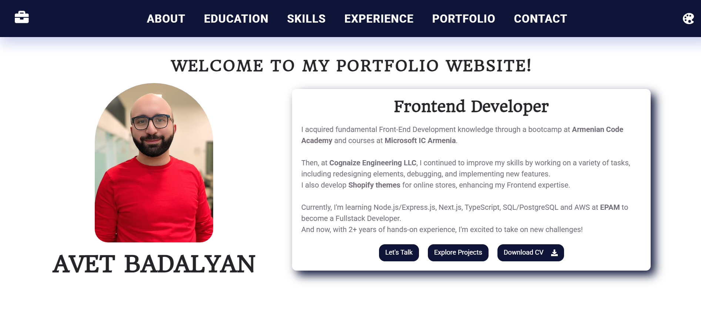
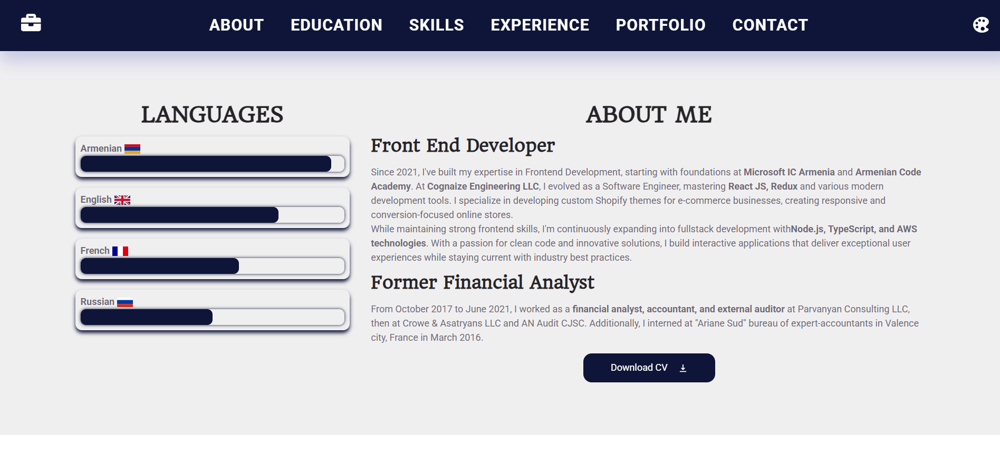
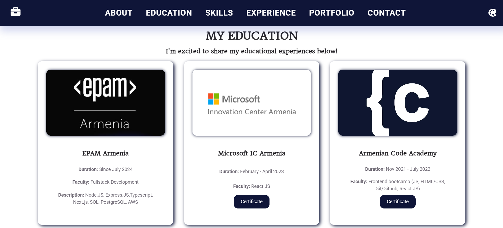
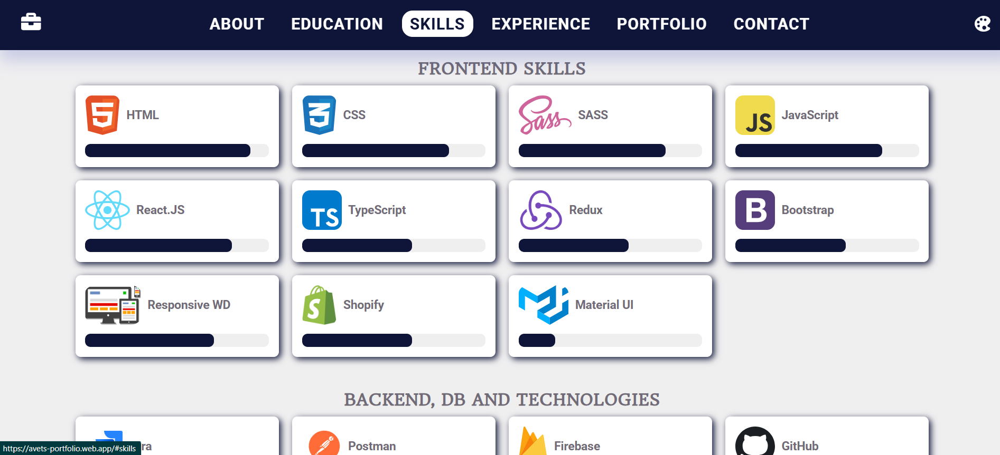
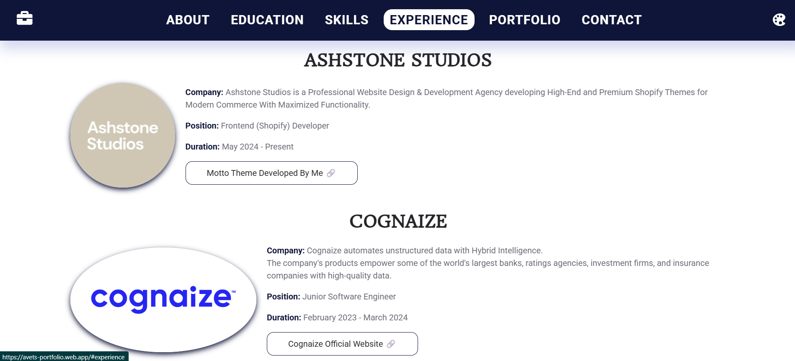
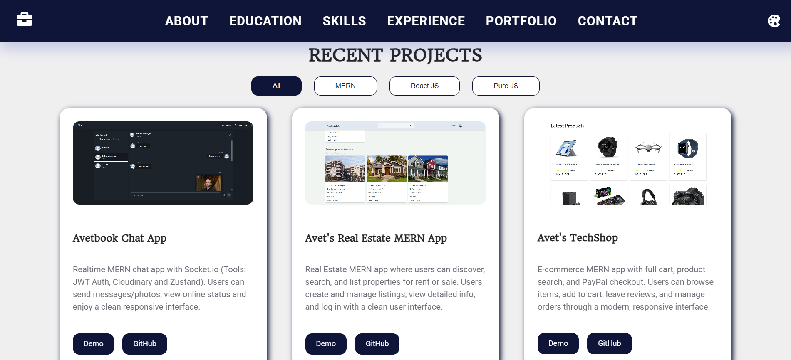

# 🌐 Avet's Portfolio Website

### Responsive • Adaptive • Built with React 19

Welcome to my personal **Portfolio Website**, where I share my journey as a web
developer — from my education and skills to the web applications I've designed
and built.

This project showcases not just my technical work, but also my design sense and
commitment to creating modern, user-friendly digital experiences.

---

## ✨ About the Website

My portfolio is a **fully responsive React 19 application** with a polished
design system, optimized for **desktop, tablet, and mobile devices**.

It features:

- 🌙 **Dark/Light Theme Toggle** — Switch between dark and light modes with smooth transitions.
- 🧭 **Smooth Navigation** — Explore sections including _About Me_, _Education_,
  _Skills_, _Currently Learning_, _Experience_, _Portfolio_, and _Contact_.
- 💼 **Project Showcase** — Browse 16 web apps with category filters, detailed modals, and live demos.
- ✨ **Modern Interactions** — Magnetic buttons, tilt cards, animated counters, and subtle micro-animations.
- ♿ **Accessible** — Focus traps, keyboard navigation, reduced-motion support, and proper ARIA labels.
- ⚙️ **Clean Architecture** — Component-based design with a consistent token-based design system.

---

## 🚀 Live Website

👉 Visit here:
[**https://avets-portfolio.web.app/**](https://avets-portfolio.web.app/)

---

## 💡 Tech Stack

- **Frontend:** React 19, Vite, SCSS, Framer Motion
- **State:** React Context (theme)
- **Hosting:** Firebase
- **Design System:** CSS custom properties for colors, spacing, typography, shadows, and transitions

---

## 🧩 Featured Projects

Some of the web apps featured in my portfolio include:

| Category   | Project                                                            | Description                                                                            |
| ---------- | ------------------------------------------------------------------ | -------------------------------------------------------------------------------------- |
| Full Stack | [**Music App**](https://main.d3kojl89wftd85.amplifyapp.com/)       | Full-stack music library with React, Node.js, PostgreSQL, and persistent audio player. |
| Full Stack | [**EduScheduler**](https://edu-scheduler-aca.vercel.app)           | University timetable generator with backtracking CSP algorithm.                        |
| MERN       | [**Avetbook Chat App**](https://avetbook-chat-app.onrender.com)    | Real-time chat with Socket.io, typing indicators, and online presence.                 |
| MERN       | [**Real Estate App**](https://avets-real-estate.vercel.app)        | Property search across 10 countries with Google Maps integration.                      |
| MERN       | [**TechShop**](https://avets-techshop.vercel.app/)                 | E-commerce with server-verified PayPal checkout — React 19, Express 5, RTK Query.      |
| React.js   | [**Battleship Game**](https://aca-battleship.vercel.app/)          | Classic Battleship vs AI with Hunt/Target algorithm, drag-and-drop, and sound effects. |
| React.js   | [**Fashion Store**](https://modern-fashion-store-theta.vercel.app) | E-commerce with size/color variants, faceted filters, wishlist, and checkout flow.     |

_(16 projects total — see the live site for the complete list!)_

---

## 🧑‍💻 Behind the Code

The goal of this portfolio was to create a **clean, intuitive, and visually
appealing** space to present my work — blending **modern frontend design** with
**practical fullstack functionality**.

Every component was thoughtfully crafted with a consistent design system:

- **Token-based styling** — Colors, spacing, typography, shadows, and transitions as CSS variables
- **Glassmorphism effects** — Subtle blur and transparency for depth
- **Responsive breakpoints** — Optimized layouts at 1200px, 1024px, 768px, 600px, and 480px
- **Accessibility-first** — Focus indicators, keyboard navigation, and motion preferences

---

## 📸 Screenshots

---

## 🗣️ Contact

Feel free to reach out — I'm always open to collaborating, sharing knowledge, or
discussing exciting new projects.

📩 **Email:** avetbadalyan@gmail.com  
💼 **LinkedIn:** [linkedin.com/in/avet-badalyan-17b767101](https://www.linkedin.com/in/avet-badalyan-17b767101/)  
🐙 **GitHub:** [github.com/AvetBadalyan](https://github.com/AvetBadalyan)
