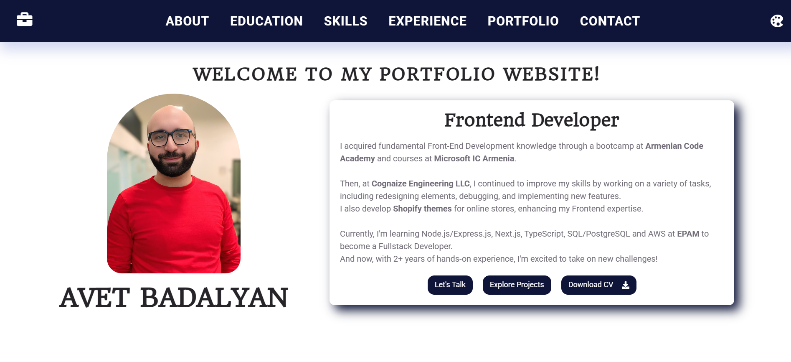
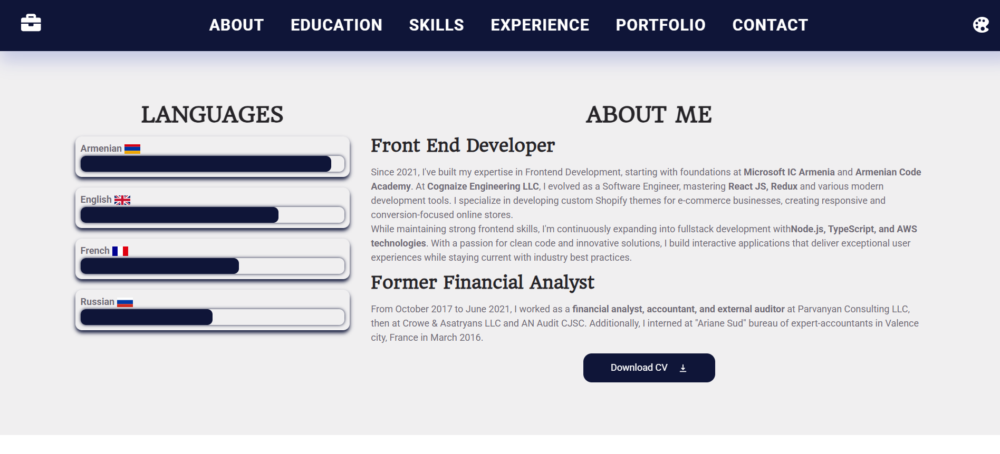
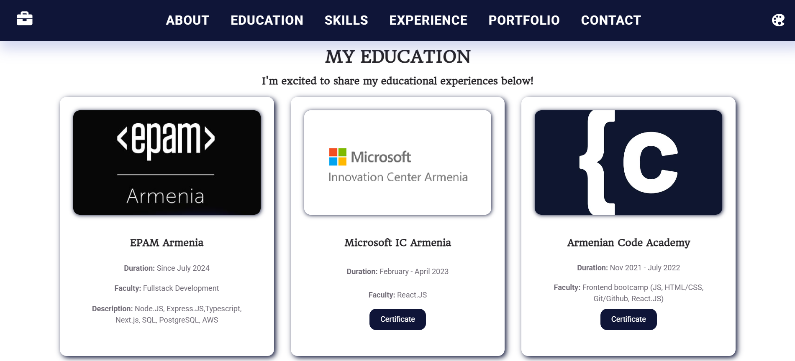
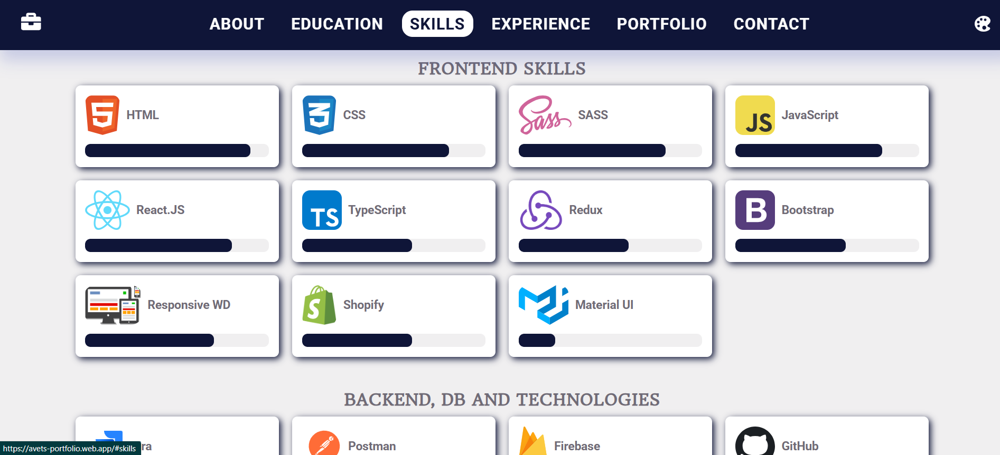
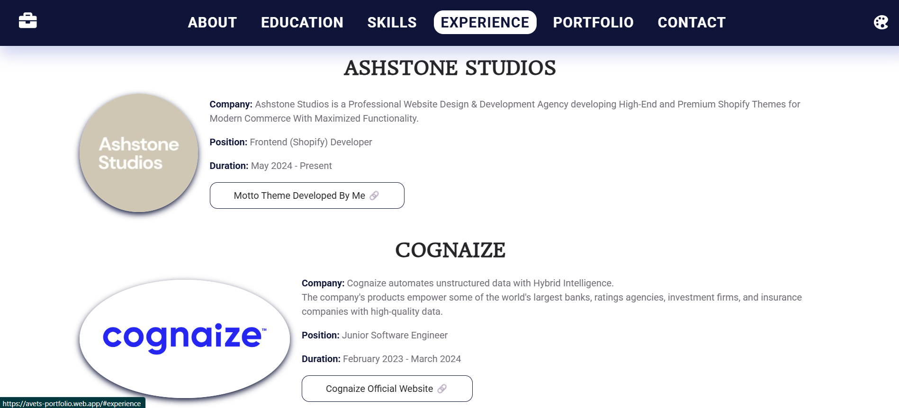
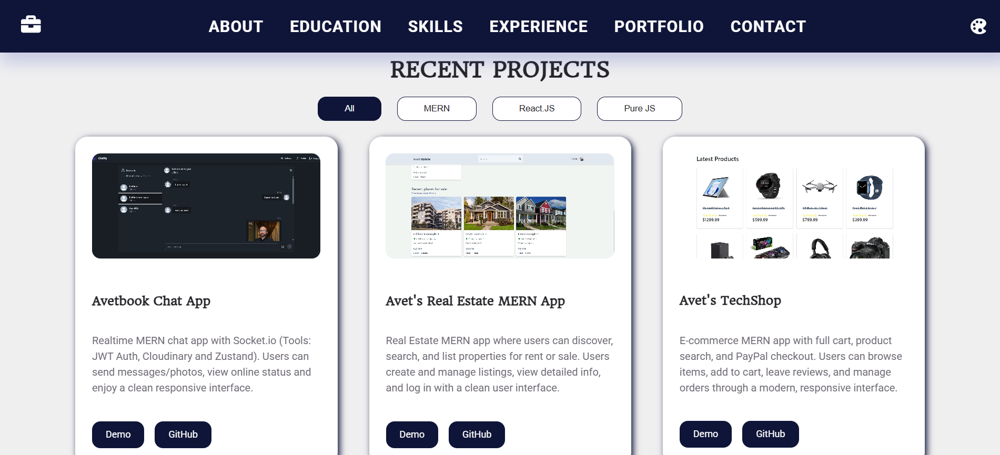

# 🌐 Avet's Portfolio Website

### Responsive • Adaptive • Built with React 19

Welcome to my personal **Portfolio Website**, where I share my journey as a web
developer — from my education and skills to the web applications I've designed
and built.

This project showcases not just my technical work, but also my design sense and
commitment to creating modern, user-friendly digital experiences.

---

## ✨ About the Website

My portfolio is a **fully responsive React 19 application** with a polished
design system, optimized for **desktop, tablet, and mobile devices**.

It features:

- 🌙 **Dark/Light Theme Toggle** — Instant, flicker-free theme switch with system-preference detection and `localStorage` persistence.
- 🧭 **Smooth Navigation** — Explore sections including _About Me_, _Education_,
  _Skills_, _Currently Learning_, _Experience_, _Portfolio_, and _Contact_.
- 💼 **Project Showcase** — Browse 20 web apps with category filters, detailed modals, and live demos.
- ✨ **Modern Interactions** — Tilt cards, animated counters, scroll-reveal, and subtle micro-animations.
- ♿ **Accessible** — Focus traps with focus restoration, keyboard navigation, reduced-motion support, and proper ARIA labels.
- ⚙️ **Clean Architecture** — Component-based design with a consistent token-based design system.

---

## 🚀 Live Website

👉 Visit here:
[**https://avets-portfolio.web.app/**](https://avets-portfolio.web.app/)

---

## 💡 Tech Stack

- **Frontend:** React 19, Vite, SCSS, Framer Motion
- **State:** React Context (theme)
- **Hosting:** Firebase
- **Design System:** CSS custom properties for colors, spacing, typography, shadows, and transitions

---

## 🧩 Featured Projects

Some of the web apps featured in my portfolio include:

| Category   | Project                                                              | Description                                                                            |
| ---------- | -------------------------------------------------------------------- | -------------------------------------------------------------------------------------- |
| Shopify    | [**Force Theme**](https://themes.shopify.com/themes/force)           | Premium Shopify theme ($320) — dark, high-contrast design with 100% positive reviews.  |
| Shopify    | [**Monochrome Theme**](https://themes.shopify.com/themes/monochrome) | Premium Shopify theme ($320) — minimal design with 30+ sections and scroll animations. |
| Full Stack | [**JobList.am**](https://joblist-am.vercel.app)                      | Job marketplace with role-based auth — React, Redux, Supabase with Row Level Security. |
| Full Stack | [**EduScheduler**](https://edu-scheduler-aca.vercel.app)             | University timetable generator with backtracking CSP algorithm.                        |
| MERN       | [**Avetbook Chat App**](https://avetbook-chat-app.onrender.com)      | Real-time chat with Socket.io, typing indicators, and online presence.                 |
| MERN       | [**Real Estate App**](https://avets-real-estate.vercel.app)          | Property search across 10 countries with Google Maps integration.                      |
| React.js   | [**Battleship Game**](https://aca-battleship.vercel.app/)            | Classic Battleship vs AI with Hunt/Target algorithm, drag-and-drop, and sound effects. |

_(20 projects total — see the live site for the complete list!)_

---

## 🧑‍💻 Behind the Code

The goal of this portfolio was to create a **clean, intuitive, and visually
appealing** space to present my work — blending **modern frontend design** with
**practical fullstack functionality**.

Every component was thoughtfully crafted with a consistent design system:

- **Token-based styling** — Colors, spacing, typography, shadows, and transitions as CSS variables
- **Glassmorphism effects** — Subtle blur and transparency for depth
- **Responsive breakpoints** — Optimized layouts across a documented breakpoint scale (375 / 480 / 600 / 768 / 900 / 1024 / 1200px)
- **Accessibility-first** — Focus indicators, keyboard navigation, and motion preferences

---

## 📸 Screenshots

---

## 🗣️ Contact

Feel free to reach out — I'm always open to collaborating, sharing knowledge, or
discussing exciting new projects.

📩 **Email:** avetbadalyan@gmail.com  
💼 **LinkedIn:** [linkedin.com/in/avet-badalyan-17b767101](https://www.linkedin.com/in/avet-badalyan-17b767101/)  
🐙 **GitHub:** [github.com/AvetBadalyan](https://github.com/AvetBadalyan)
