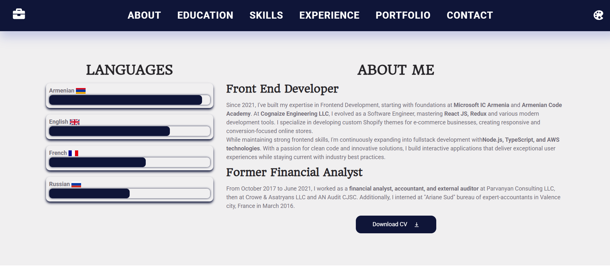

# Avet's Portfolio Website

### (including Responsive & Adaptive design both for Web and Tablets and Mobile)

## I am excited to share with you my Portfolio Website, where you can find info about my career, education, skills and deployed apps!

Besides the Home page with main info and links you can find here the "About me" page, "Skills" and the main "Portfolio" page where I regularly add the web apps I build and deploy.
You can change also the theme of the page by selecting one of 4 colors from the palette.

Link to the Website - [https://avets-portfolio.web.app/](https://avets-portfolio.web.app/).

