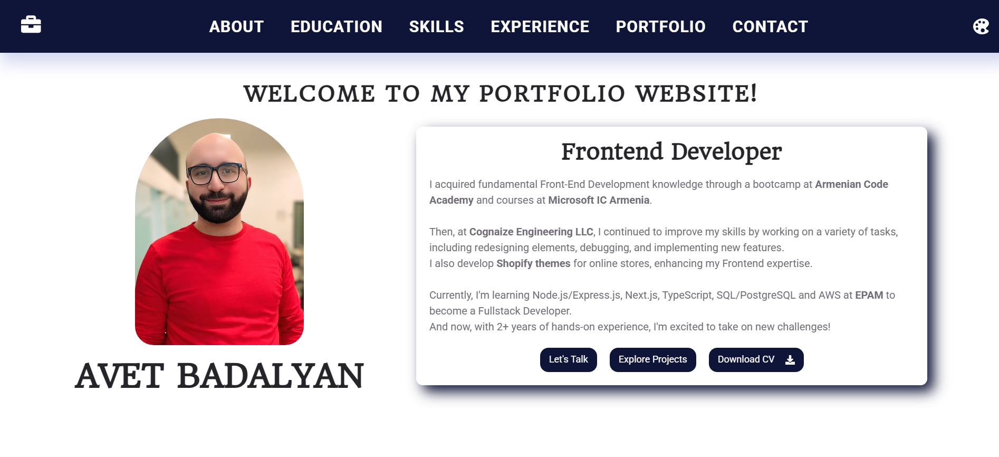
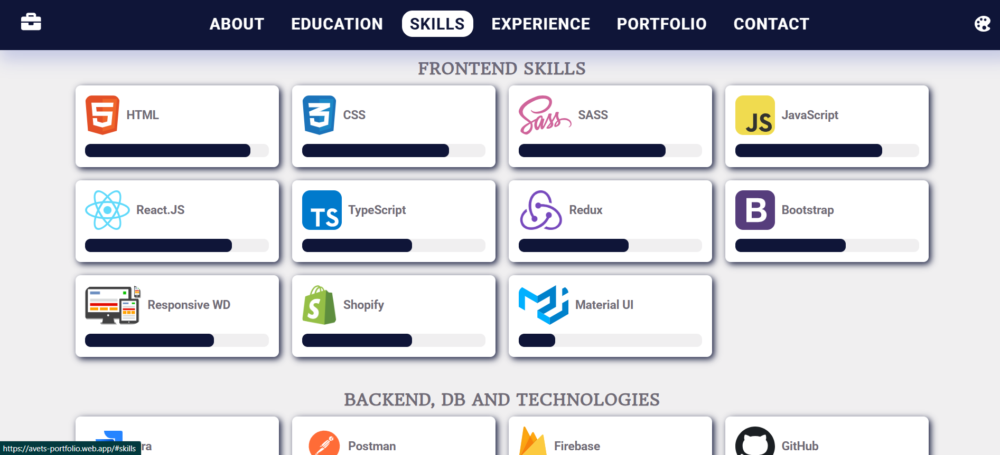

# 🌐 Avet's Portfolio Website

### Responsive • Adaptive • Built with React.js

Welcome to my personal **Portfolio Website**, where I share my journey as a web developer — from my education and skills to the web applications I’ve designed and built.

This project showcases not just my technical work, but also my design sense and commitment to creating modern, user-friendly digital experiences.

---

## ✨ About the Website

My portfolio is a **fully responsive and adaptive React.js application**, optimized for **desktop, tablet, and mobile devices**.

It features:
- 🎨 **Dynamic Theme Switcher** — Choose from 4 color palettes to personalize your viewing experience.
- 🧭 **Smooth Navigation** — Explore pages like *About Me*, *Education*, *Skills*, *Experience*, *Portfolio*, and *Contact*.
- 💼 **Project Showcase** — Browse through the web apps I’ve built and deployed, including both MERN and React.js projects.
- ⚙️ **Clean Component-Based Architecture** — Designed with maintainability and scalability in mind using modern React best practices.

---

## 🚀 Live Website

👉 Visit here: [**https://avets-portfolio.web.app/**](https://avets-portfolio.web.app/)

---

## 💡 Tech Stack

- **Frontend:** React.js, Redux Toolkit, CSS Modules / SCSS etc
- **Hosting:** Firebase
- **Additional Tools:**  Cloudinary, Socket.io, MongoDB, Express.js, Node.js etc

---

## 🧩 Featured Projects

Some of the web apps featured in my portfolio include:

| Category | Project | Description |
|-----------|----------|--------------|
| MERN | [**Avetbook Chat App**](https://avetbook-chat-app.onrender.com) | Real-time chat with Socket.io, JWT authentication, and Cloudinary image uploads. |
| MERN | [**Real Estate App**](https://mern-real-estate-project-8jqd.onrender.com/) | Browse, search, and list properties with a clean and responsive UI. |
| MERN | [**TechShop E-commerce**](https://avets-techshop.onrender.com/) | Full shopping experience with cart, reviews, and PayPal checkout. |
| React.js | [**Online Food Store**](https://online-foodstore.web.app/) | Meal browsing and ordering with responsive design. |
| React.js | [**Todo List with Redux Toolkit**](https://todo-list-with-redux-toolkit.web.app/) | Smart task manager with deadline tracking. |
| Pure JS | [**Joke Teller**](https://get-joke-f9568.web.app/) | Fun voice-based joke app using text-to-speech. |

*(More apps are regularly added — check back for updates!)*

---

## 🧑‍💻 Behind the Code

The goal of this portfolio was to create a **clean, intuitive, and visually appealing** space to present my work — blending **modern frontend design** with **practical fullstack functionality**.

Every component, from the theme selector to the portfolio grid, was thoughtfully crafted for performance and usability.

---

## 📸 Screenshots

---

## 🗣️ Contact

Feel free to reach out — I’m always open to collaborating, sharing knowledge, or discussing exciting new projects.

📩 **Email:** [avetbadalyan@gmail.com]
💼 **LinkedIn:** [https://www.linkedin.com/in/avet-badalyan-17b767101/](https://www.linkedin.com/in/avet-badalyan-17b767101/)
